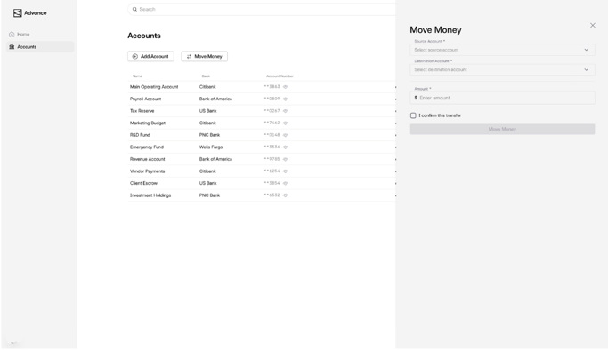

# Advance Frontend - Interview Assignment

A Next.js application with the full Advance design system, component library, and layout infrastructure.

## Prerequisites

- Node.js 22.9.0
- Yarn 1.22.22

## Setup

```bash
yarn install
yarn dev
```

Open [http://localhost:3000](http://localhost:3000).

## Available Commands

| Command | Description |
|---------|-------------|
| `yarn dev` | Start dev server (Turbo mode) |
| `yarn build` | Production build |
| `yarn ts` | TypeScript type check |
| `yarn lint` | ESLint |
| `yarn lint:fix` | ESLint autofix |
| `yarn fm:check` | Prettier check |
| `yarn fm:fix` | Prettier fix |
| `yarn generate:component` | Scaffold a new component |
| `yarn generate:view` | Scaffold a new view |

## Project Structure

```
src/
  app/                    # Next.js App Router
  components/             # Reusable UI components (FlexxTable, DrawerWrapper, etc.)
  @core/                  # Design system: theme, contexts, hooks, styles
  @layouts/               # Layout components
  @menu/                  # Navigation components
  flexxApi/               # API client layer
  QueryClient/            # React Query configuration
  hooks/                  # Shared custom hooks
  domain/                 # TypeScript type definitions
  utils/                  # Utility functions
  configs/                # App configuration
  constants/              # Constants
```

## Key Components

- **FlexxTable** - Data table with sorting, filtering, pagination
- **DrawerWrapper** - Drawer/panel layout component
- **FlexxCustomTextInputs** - Form input components
- **AdvanceCurrencyText** - Currency formatting component
- **FlexxDashboardWrapper** - Page wrapper component

## Backend API Schema

[API Documentation](https://internal-fe-mock-provider.r6zcf729z3zke.us-east-1.cs.amazonlightsail.com/docs)

## Tasks

This is a FE task evaluating your skills.

### 1. Account Drawer

When clicking on an account in the accounts dashboard, open a drawer that has a header with the account's details and a table with all of its transactions.


### 2. Create Account

Implement a "Create Account" CTA on the accounts dashboard. When clicked it should open a drawer with text fields for all the attributes of an account and an "Add Account" button. After creating the account, the accounts dashboard should open the drawer to the newly created account.


### 3. Move Money

Implement a "Move Money" CTA on the accounts dashboard. When clicked it should open a drawer with the following fields: source account, destination account, and amount. Add a checkbox that needs to be checked before being able to initiate the move money. Include a "Move Money" button to submit.


### 4. Transactions Dashboard

Add a transactions dashboard that shows all the transactions in a table.


### Any additional features you would like to add will be appreciated!!
Be sure to let us know what you have added and why.

### You will be evaluated based on: 
1. The quality of the code
2. The UI/UX
3. The maintainability of the code

## Stack

- Next.js 16 with App Router
- React 19
- TypeScript
- MUI v5
- Tailwind CSS
- React Query v3
- React Hook Form
